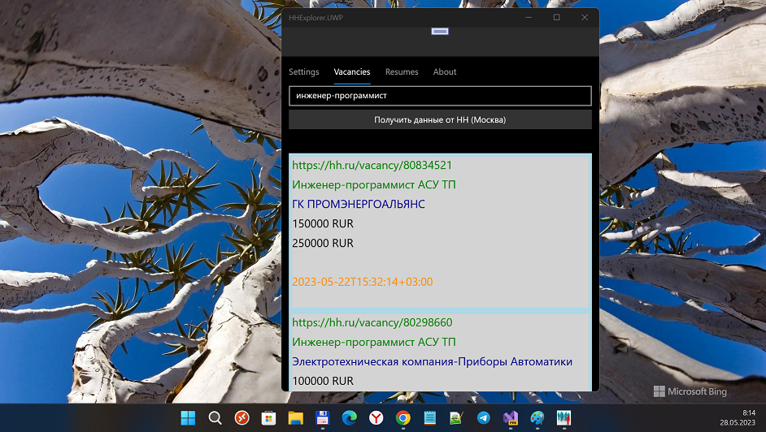

# HHExplorer  / "Исследователь HH" 1.1.1 "alpha" (or even "zero"...)

HeadHunter (hh.ru) Vacancies explorer. Штука для взаимодействия с HH через API. Была сделана по причине устаревания 
стандартного приложения HH для винфонов (оно тупо не даёт залогиниться на портал, а значит искать вакансии).

RU only. Только для России.

## Screenshots. Скриншоты

## Current Status
- Damaged / transformed to "HH concept" (idea only; horizontal menu added). Функционал разрушен, счас это всё лишь "концепт" нового HH...
- Min. Win. os. build = 15063 (No Astoria compatibility). Минимальная версия сборки Windows изменена на 15063 (совместимость с Astoria нарушена) 
- Auth (Login) page added. No settings store at now.
- Android/iOS targets are only "dummies" (stubs) at now.

## How to get your HH credentials?
- Follow https://dev.hh.ru   
- Modify HHExplorer\HHExplorer\Api\HHCOnfiguration.cs

## TODO
- Add Map. Добавить Карту.
- Add Geo-location. Реализовать некую геолокацию (привязку вакансий к опр. станции метро и т.п.).

## .

AS IS. Как есть.

[m][e] 2022-2023

