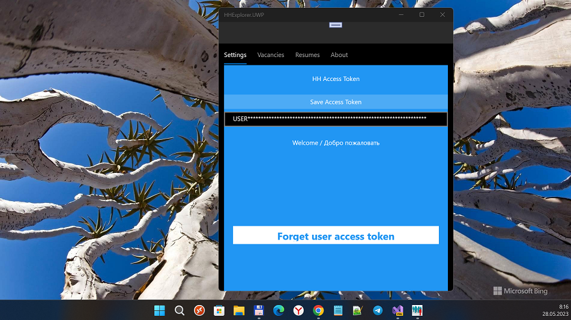
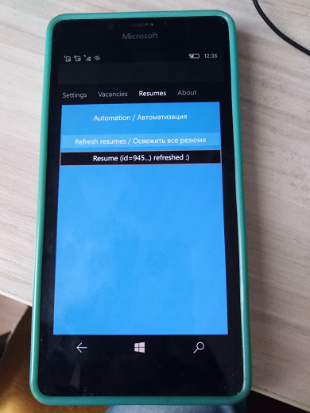
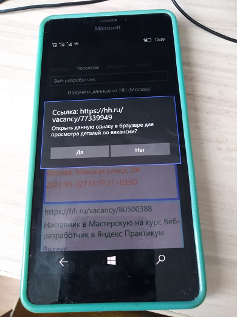

# HHExplorer  / "Исследователь HH" 1.1.3-alpha

HeadHunter (hh.ru) Vacancies explorer. Штука для взаимодействия с HH через API. Была сделана по причине устаревания 
стандартного приложения HH для винфонов (оно тупо не даёт залогиниться на портал, а значит искать вакансии).

RU only. Только для России.

## Screenshots. Скриншоты

## Current Status. Текущий статус
- Functional reduced. Функционал сильно ограничен, пока это поделие всё лишь черновик, "концепт" нового мультиплатформенного HH-клиента...
- Min. Win. os. build = 15063 (No Astoria compatibility). Минимальная версия сборки Windows изменена на 15063 (совместимость с Astoria отсутствует). 
- Auth (Login) page added. The access token stored when the user logined (and acc. token removed when the user "log-outed").
- Resumes page added. Just Click Resume refresh to refresh date-time "marker" for all your resumes :) 
- Android/iOS targets are only "dummies" (stubs) at now. Таргеты Android/iOS пока лишь "заглушки".

## How to get your HH credentials and build/install your own app? Как получить собственные креденшиалы от HH и собрать/установить свою сборку HHExplorer?
- Follow https://dev.hh.ru and get your HH credentials. Пройдите на https://dev.hh.ru и сформируйте свои ключи к HH.  
- Modify HHExplorer\HHExplorer\Api\HHConfiguration.cs. Впишите эти ключи в HHExplorer\HHExplorer\Api\HHConfiguration.cs.
- Deploy result (choose x64 and ARM targets) HHExplorer onto your PC and WinPhone. Задеплойте приложение HHExplorer на свой ПК и винфон.

## TODO. Что сделать?
- Add Map. Добавить Карту.
- Add Geo-location. Реализовать некую геолокацию (привязку вакансий к опр. станции метро и т.п.).
- Add normal TextBox/TextBlock for Resumes page and etc...

## .

AS IS. Как есть.

[m][e] 2022-2023

P.S. UWP и WebView (EDGE), используемые в проекте, на данный момент сильно устарели. Чтоб получить токен пользователя для HH Api, придется сильно поизголяться: запустите на ПК программу HHExplorer. Когда вылезат окошко авторизации, не вводите сразу логин-пароль от HH (джаваскрипт на кнопке Войти не отработает), а пожикайте пимпы с названицами типа "Хочу войти как организация", затем "Всё ж хочу как частное лицо", а затем "авторизоваться через VK" (да, для этого необходим ВК-аккаунт). Дальше как-то перешлите этот токен на свой винфон, ну и далее на винфоне откройте HHExplorer и вбейте в поле ввода HH Access Token сей токен и сохраните его для дальшейшей, уже мобильной работы с сервисом HH...

